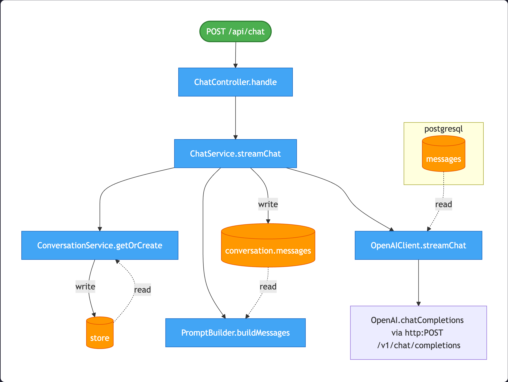

<div align="center">
  
  <h1>Bodhi DSL</h1>
  <p><strong>v0.1.0 — Early Preview</strong> | Solo research project. Development pace depends on availability. Issues and ideas welcome; response time is not guaranteed.</p>
  <p><em>The semantic layer between code and AI — making every codebase self-describing.</em></p>
</div>

**Bodhi DSL** is an AI-native semantic annotation protocol. It makes Claude Code **simultaneously write code and
structured DSL** — capturing business intent, data flows, service dependencies, event chains, error handling paths, and
state machines **at write time**, as a natural part of coding.

Static analysis can see *what* code does, but not *why*. Comments rot, docs drift, architecture diagrams go stale on day
one. Bodhi DSL solves this by making the AI that writes the code also write the semantics — inline `@bodhi.*` tags on
every function, plus `.bodhi/` system files that describe how services, entities, events, and state machines connect
across your entire system.

**The vision**: a world where every codebase carries a living, machine-readable knowledge graph — maintained by AI,
verified in CI, and consumed by AI agents for bug triage, impact analysis, cross-service tracing, and autonomous code
reasoning. Not documentation for humans to read and forget, but structured intelligence for AI to act on.

## Best For

Bodhi is designed for **AI-first projects** — codebases where AI writes the code from scratch. In this workflow, Claude generates code and DSL annotations simultaneously, keeping semantics accurate and complete from day one.

For **existing / legacy projects**, you can use `bodhi-scan` to retrofit annotations, but coverage and accuracy will depend on code complexity and style. Projects with heavy reflection, runtime wiring, or deep inheritance hierarchies are harder for AI to annotate reliably. Treat `bodhi-scan` results as a starting point that needs human review.

## Best Practices: How to Work with AI + Bodhi

Bodhi's design-first workflow works best when you **tell AI the whole picture first, not one step at a time**.

### Tell AI *what* you want, not *how* to implement it

```
❌ Bad — feeding implementation details one by one:

  "Create an OrderController with a POST /api/orders endpoint"
  (AI writes code)
  "Now add inventory deduction, call inventory-service via gRPC"
  (AI patches code)
  "Oh and publish an order_created event to Kafka"
  (AI patches again, YAML skeleton is incomplete or missing)

✅ Good — describe the business intent upfront:

  "Users place an order: deduct inventory (gRPC to inventory-service),
   hold payment (HTTP to payment-service), persist the order,
   and publish order_created to Kafka. Return 400 if inventory
   is insufficient, circuit-break on payment timeout."
```

When AI sees the full picture, it can design the complete YAML skeleton first — flows, entities, events, cross-service dependencies, error handling — and then implement every function in one coherent pass. When it only sees one piece at a time, each addition is a patch, and the skeleton is either incomplete or never created.

### Recommended workflow

```
Step 1 → /bodhi-design <describe the full feature>
            AI produces YAML skeleton only, no code
            You review: are the flows, entities, events correct?

Step 2 → "Looks good, proceed to implement"
            AI writes code + inline tags, guided by the skeleton
            Hook validates consistency after every edit

Step 3 → Review the code as usual
```

You don't need to write a formal PRD. A few sentences describing the business intent, key operations, external dependencies, and error scenarios is enough. The AI will ask if anything is ambiguous.

**Even without `/bodhi-design`**, describing the feature in full triggers the same workflow automatically — Claude will produce the skeleton and ask for confirmation before writing code. But the explicit command makes the separation between "design" and "implement" clearer and gives you a natural review checkpoint.

## Why Bodhi

| Problem                                                      | Bodhi's Answer                                                                         |
|--------------------------------------------------------------|----------------------------------------------------------------------------------------|
| Static analysis sees *what*, not *why*                       | `@bodhi.intent` captures business purpose on every function                            |
| Architecture docs go stale on day one                        | `.bodhi/` YAML files are maintained by AI as code changes                              |
| Cross-service tracing requires runtime infra                 | `@bodhi.calls via`, `.bodhi/services/`, `.bodhi/events/` map the full topology at rest |
| Bug triage needs tribal knowledge                            | AI agents read the semantic graph to reason about failures autonomously                |
| "What does this service depend on?" requires asking 3 people | `depends_on` with protocols, APIs, and resilience policies — always up to date         |

## What It Does

### Layer 1: Inline Tags (every function)

Claude writes code and simultaneously adds `@bodhi.*` annotations in doc comments:

```java
/**
 * @bodhi.intent Create order, deduct inventory, publish domain event
 * @bodhi.reads request.body(userId, items, address)
 * @bodhi.writes orders(id, userId, totalAmount, status=PENDING) via INSERT
 * @bodhi.calls InventoryService.deduct, PaymentService.hold
 * @bodhi.emits order_created(orderId, userId) to kafka:order-events
 * @bodhi.on_fail inventory_insufficient → reject 400
 */
public OrderResponse create(CreateOrderRequest req) { ... }
```

### Layer 2: System Files (structural changes)

When Claude creates an API, a database model, or a state machine, it also writes the corresponding `.bodhi/` YAML:

```
.bodhi/
├── bodhi.yaml              # Project metadata (+ distributed block for microservices)
├── flows/create_order.yaml # Request-to-response call chains (supports cross-service steps)
├── entities/orders.yaml    # Database table semantics
├── states/order_lifecycle.yaml  # State machines
├── events/order_created.yaml   # Event catalog (producers/consumers)
├── services/order-service.yaml # Service topology — multi-protocol APIs (http, grpc, ws, etc.)
├── channels/order_ws.yaml  # Bidirectional channels (WebSocket, TCP, etc.)
├── topology/order_flow.yaml # Cross-service event chains
└── concepts/glossary.yaml  # Business glossary
```

Works with **Java, Python, Go, TypeScript, Kotlin, Rust, C#, C, C++**.

## Quick Start

### 1. Enable DSL generation for new code

Copy `CLAUDE.md` and the Claude Code hook into your project. Claude Code reads `CLAUDE.md` on every conversation
and follows the DSL generation rules. The hook runs `bodhi validate` after every file edit, surfacing inconsistencies
immediately so Claude can fix them in the same session.

```bash
git clone https://github.com/anthropics/bodhi.git

# Rules file — Claude reads this on every conversation
cp bodhi/templates/CLAUDE.md /path/to/your-project/CLAUDE.md

# PostToolUse hook — validates DSL after every Edit/Write
mkdir -p /path/to/your-project/.claude/hooks
cp bodhi/templates/.claude/settings.json /path/to/your-project/.claude/settings.json
cp bodhi/templates/.claude/hooks/bodhi-check.sh /path/to/your-project/.claude/hooks/
chmod +x /path/to/your-project/.claude/hooks/bodhi-check.sh

# Install bodhi-engine so the hook can run
pip install bodhi-engine
```

### 2. Scan existing code (optional)

Copy the slash command into your project, then use it in Claude Code:

```bash
mkdir -p /path/to/your-project/.claude/commands
cp bodhi/templates/commands/bodhi-scan.md /path/to/your-project/.claude/commands/
cp bodhi/templates/commands/bodhi-design.md /path/to/your-project/.claude/commands/
```

```
/bodhi-design <feature description>             # Design YAML skeleton before coding (recommended)
/bodhi-scan init                                # Initialize .bodhi/ directory
/bodhi-scan src/main/java/com/example/order/    # Add inline tags per directory
/bodhi-scan flows                               # Generate flow files
/bodhi-scan concepts                            # Generate glossary
```

**`/bodhi-design` is the recommended way to start a new feature.** Describe what you want in natural language, and Claude will produce the complete YAML skeleton (flows, entities, events, channels, topology) for your review before writing any code. Even if you skip `/bodhi-design` and describe the feature directly, Claude will automatically run the design-first workflow — but the explicit command makes the intent clearer.

### 3. Validate in CI (optional)

```bash
pip install bodhi-engine
bodhi validate .
```

## Examples

### Flow Visualization (`bodhi show flow`)

Render a color-coded call chain in the terminal — each step shows function name, intent, data access, error handling, and cross-service calls.


### Coverage Dashboard (`bodhi show stats`)

See how well your codebase is annotated at a glance — progress bars per tag type, Layer 2 asset counts, and actionable hints about missing annotations.


### Flow Graph (`bodhi graph`)

Generate visual call graphs from flow definitions — color-coded nodes for entry points, functions, database tables, events, and remote calls. Tables sharing the same datasource are grouped together.



## CLI Reference

All commands accept `--exclude DIR1 DIR2` to skip scanning certain directories.

### Validation & Analysis

```bash
bodhi validate [path]              # Check DSL completeness and consistency (CI gate, exit 1 on errors)
bodhi check [path]                 # Check inline tags vs .bodhi/ YAML consistency
bodhi stats [path]                 # Output coverage statistics as JSON
bodhi derive [path]                # Scaffold .bodhi/ YAML from inline tags (cold-start)
```

### Visualization

```bash
bodhi show -p <path> flow          # List all available flows
bodhi show -p <path> flow <name>   # Visualize a flow's call chain (colored terminal output)
bodhi show -p <path> stats         # Coverage dashboard with progress bars and completeness hints
bodhi graph [path]                 # Generate Mermaid diagram for all flows (stdout)
bodhi graph [path] --flow <name>   # Generate Mermaid diagram for a single flow
bodhi graph [path] -o diagram.html # Render to HTML (zero dependencies, open in browser)
bodhi graph [path] -o diagram.svg  # Render to SVG/PNG/PDF (requires mmdc)
```

`bodhi show flow` renders a color-coded call chain in the terminal — each step shows function name, intent, reads/writes, emits, on_fail, and cross-service calls. `bodhi show stats` displays a coverage dashboard with colored progress bars for each tag type and hints about missing annotations.

`bodhi graph` generates Mermaid diagrams with color-coded nodes: green for entry points, blue for functions, orange for database tables, purple for events, red dashed for remote calls. Rendering to SVG/PNG requires [mermaid-cli](https://github.com/mermaid-js/mermaid-cli): `npm install -g @mermaid-js/mermaid-cli`

### MCP Server

```bash
bodhi serve [path]                 # Start MCP server for a single service
bodhi serve-all [path]             # Start federated MCP server for a multi-service workspace
```

Configure in Claude Code (`~/.claude/settings.json` or project `.claude/settings.json`):

```json
{
  "mcpServers": {
    "bodhi": {
      "command": "bodhi",
      "args": ["serve", "/path/to/your-project"]
    }
  }
}
```

Available MCP tools:

| Tool              | What It Does                                      | Example Question                              |
|-------------------|---------------------------------------------------|-----------------------------------------------|
| `query_flow`      | Return a complete request-to-response call chain  | "How does the create order API work?"         |
| `trace_entity`    | Find all functions that read/write a given entity | "What touches the `orders` table?"            |
| `find_consumers`  | Find all consumers of a given event               | "What happens when `order_created` fires?"    |
| `impact_analysis` | Trace the blast radius of a change                | "What breaks if I change `OrderService.create`?" |
| `query_state`     | Return state machine transitions                  | "What are the valid transitions from PAID?"   |
| `service_deps`    | Return upstream/downstream service dependencies   | "What does order-service depend on?"          |
| `query_channel`   | Return a bidirectional channel definition          | "What events does the order WebSocket handle?" |
| `query_topology`  | Return a cross-service event chain                | "How does the order fulfillment event flow work?" |
| `list_*`          | List available flows, entities, events, services, state machines, channels, topologies | "What flows exist in this project?" |

### Workspace (Multi-Service)

```bash
bodhi workspace-validate [path]    # Validate cross-service consistency (event schema mismatch, broken flow_ref, etc.)
```

### CI Integration

```yaml
- name: Validate Bodhi DSL
  run: |
    pip install bodhi-engine
    bodhi validate .
```

`bodhi validate` exits with code 1 on errors, suitable as a CI gate. `bodhi stats` outputs JSON for dashboards or coverage tracking.

## AI-Friendly Code Style

Bodhi doesn't just annotate code — it promotes a coding style that is **statically traceable from source text**. If AI cannot determine the execution path by reading the source, the code is not AI-friendly.

**Core principles:**

- **Functions + modules over classes + inheritance** — direct calls are grepable; vtable dispatch is not
- **Explicit routing over polymorphism** — `if`/`switch`/`match` at the call site, every branch visible
- **Data structures over objects with behavior** — records / dataclasses / structs, not getter/setter mazes
- **Explicit dependencies over injection** — pass as parameters, not auto-wired by a container
- **`@bodhi.*` tags are remediation, not default** — write traceable code first; tag only unavoidable indirection

**Refactoring principle: extract into modules and functions, not into class hierarchies.**

- Extract function / module → good (preserves traceability)
- Extract interface for a single implementation → bad (adds indirection for no benefit)
- Replace `if`/`switch` with polymorphic dispatch → bad (hides routing)

Per-language rules for Java, Go, Python, Kotlin, TypeScript, Rust, C#, C, and C++ are in [`templates/CLAUDE.md`](templates/CLAUDE.md).

## Tag Reference

### Core Tags (P0 — always add)

| Tag             | Purpose              | Example                                            |
|-----------------|----------------------|----------------------------------------------------|
| `@bodhi.intent` | Business purpose     | `@bodhi.intent Create order and deduct inventory`  |
| `@bodhi.reads`  | Data sources read    | `@bodhi.reads orders(id, status) WHERE userId = ?` |
| `@bodhi.writes` | Data targets written | `@bodhi.writes orders(status=PAID) via UPDATE`     |

### Relationship Tags (P1 — add when applicable)

| Tag              | Purpose            | Example                                               |
|------------------|--------------------|-------------------------------------------------------|
| `@bodhi.calls`   | Key function calls | `@bodhi.calls PaymentService.charge`                  |
| `@bodhi.emits`   | Events published   | `@bodhi.emits order_created(orderId) to kafka:orders` |
| `@bodhi.on_fail` | Error handling     | `@bodhi.on_fail timeout → retry 3 → reject 500`       |

### Constraint Tags (P2 — add if obvious)

| Tag                  | Purpose             | Example                                       |
|----------------------|---------------------|-----------------------------------------------|
| `@bodhi.auth`        | Auth requirements   | `@bodhi.auth required(role=ADMIN)`            |
| `@bodhi.validate`    | Validation rules    | `@bodhi.validate amount > 0`                  |
| `@bodhi.log.success` | Success log pattern | `@bodhi.log.success "Order {id} created"`     |
| `@bodhi.log.error`   | Error log pattern   | `@bodhi.log.error "Payment failed: {reason}"` |

## Project Structure

```
bodhi/
├── templates/
│   ├── CLAUDE.md                  # Put in your project → Claude writes DSL with code
│   └── commands/
│       └── bodhi-scan.md          # /bodhi-scan command for existing code
├── bodhi_engine/                  # pip install → bodhi validate in CI
│   ├── parser/                    # Parses @bodhi.* tags and .bodhi/*.yaml
│   ├── validator/                 # Checks DSL completeness and consistency
│   ├── cli/                       # bodhi validate / stats / graph / serve
│   ├── knowledge.py               # In-memory knowledge graph for queries
│   └── mcp_server.py              # MCP server exposing query tools
├── tests/                         # 38 tests
├── bodhi_dsl_specification.md     # Full DSL specification
└── pyproject.toml
```

## Full Specification

See [bodhi-dsl-specification.md](bodhi_engine/docs/bodhi-dsl-specification.md) for the complete DSL specification.

## Architecture & Vision

See [architecture-and-vision.md](bodhi_engine/docs/architecture-and-vision.md) for the target architecture (MCP server), future data sources (DB, logs, metrics, traces), and long-term vision (cross-repo tracing, intent-to-code generation, living architecture diagrams).

## License

MIT
